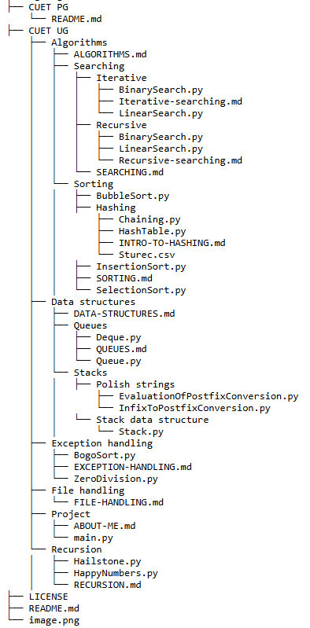

# <h1> CUET CS OPEN COURSEWARE </h1>
<br>

# INTRODUCTION 
<br>
This courseware repo is specially designed for CUET UG/CUET PG CS aspirants who are looking for a well structured
resource to help them nurture their problem solving and programming skills alongwith revising the 
concepts by practically implementing them in different problem statements.
<br>

# RESOURCES 
<b>This open courseware consists of:</b>
<ol>
<li>
<h2>Python programs:</h2>
<ul>

<li>File handling</li>
<li>Exception handling</li>
<li>Data structures</li>
<li>Algorithms</li>

</ul>
  
</li>

<li>
<h2>SQL commands:</h2>
<ul>

<li>Simple queries</li>
<li>Table creation and Data manipulation</li>
<li>Grouping records and Joins in SQL</li>
<li>Connecting Python scripts with SQL(For boards)</li>

</ul>
</li>
</ol>

# HOW TO GET STARTED
<div id="GettingStarted">
<p>The best way to utilise all the resources provided in this Github repository is to get it on
local machine, and it order to do this you can follow the below given steps to clone this Github
repository on your local machine</p> 

<ol>
<li>Create a new folder</li>
<li>Open the command prompt in the same folder (Right click -> Click on "Open in terminal")</li>
<li>Copy the following command and paste it on your command prompt: </li>
</ol>

```bash
git clone https://github.com/shreshth-xd/CUET-CS-COURSEWARE.git
```

<ul>
<li>After pasting it, hit enter</li>
<li><p>
The link provided in this code snippet is the link of this Github repository and the command 
"git clone" is used to clone/copy someone's Github repository to your local machine.
</p></li>
<li><p>NOTE: Cloning my Github repository to your local machine won't allow you to push changes
to my repository or my workspace, to revise the concepts and play around my code to study for your
exams you can keep your changes local to your machine by your simple Ctrl+S , but in case you are
someone who is looking to contribute to my courseware then you may go through the <a href="#ContriGuide">Contribution guidelines</a>.
</p></li>
</ul>
</div>

<div id="DocTree">
<h2>Navigating through the courseware:</h2>
<ul>
<li><p>The root directory of this course holds two folders <b><u>CUET UG</u></b>and<b><u>CUET PG</u></b>
made for UG and PG CS aspirants respectively.(We'll soon add resources for the PG section as well)</p></li>

<li><p>In both of these folders there are separate folders and files for each topic to be studied and practiced
as per the syllabus of CUET UG & PG.</p></li>

<li><p>There is a separate README file for each and every folder and subfolder so as to help you navigate 
through the provided resources.</p></li>

<li><p>The image below describes the overall document tree of this repository:</p></li>



</ul>
</div>

<div id="ContriGuide">
<h2>How to Contribute:</h2>
<ol>
<li>Fork the repository</li>
<li>Create a new branch (`git checkout -b feature-branch`)</li>
<li>Make your changes and commit (`git commit -m "Added feature"`)</li>
<li>Push to your branch (`git push origin feature-branch`)</li>
<li>Open a pull request!</li>
</ol>

</div>
